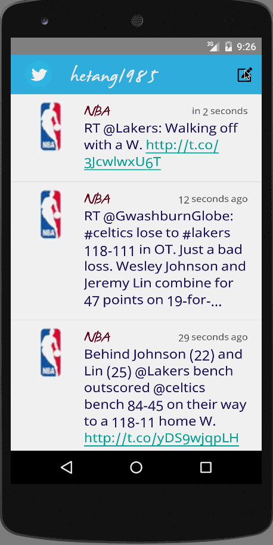

# TwitterClient
Creating Android App for Twitter Application.

Time spent: 6 hours spent in total

Completed user stories:

 * [x] User can sign in to Twitter using OAuth login.
 * [x] User can view the tweets from their home timeline
      * User should be displayed the username, name, and body for each tweet
      * User should be displayed the relative timestamp for each tweet "8m", "7h"
      * User can view more tweets as they scroll with infinite pagination
      * Optional: Links in tweets are clickable and will launch the web browser (see autolink)
 * [x] User can compose a new tweet
      * User can click a “Compose” icon in the Action Bar on the top right
      * User can then enter a new tweet and post this to twitter
      * User is taken back to home timeline with new tweet visible in timeline
 
Walkthrough of all user stories:

GIF created with [LiceCap](http://www.cockos.com/licecap/).
